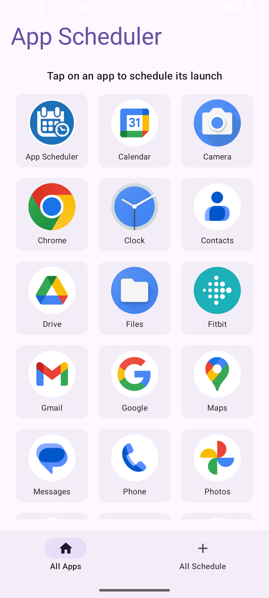
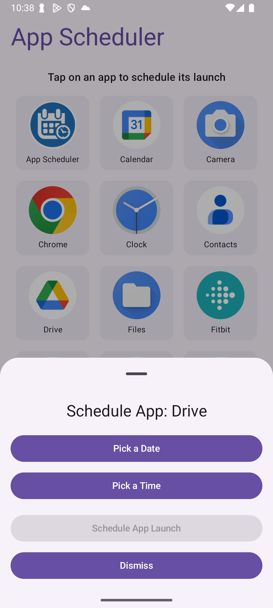
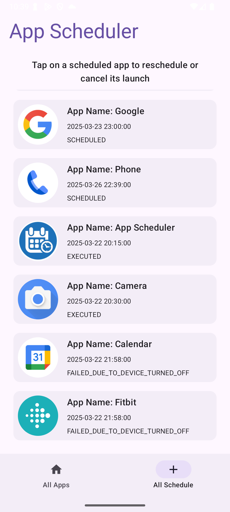

# Android App Scheduler

## Requirements
- Users can schedule any installed Android app to start at a specific time.
- Users can cancel a schedule before execution.
- Users can modify the time of an existing schedule.
- Multiple schedules are supported without conflicts.
- Schedule records must be maintained to track execution status.

## Project Analysis
### Key Tasks
1. Identify installed apps available for scheduling.
2. Allow users to set schedules for app launches.
3. Store schedule data persistently.
4. Track execution history to confirm if a scheduled app started.
5. Manage permissions for package visibility and background execution.

## Planning
### UI Planning (Wireframe)
- All App screen: Displays all installed apps and select app to schedule a launch.
- All Schedule screen: Displays all schedules and statuses, reschedule or cancel an app launch.

### Project Architecture Setup
- **Clean Architecture** for modularity and separation of concerns.
- **MVVM (Model-View-ViewModel)** for UI state management.
- **Repository Pattern** for efficient data handling.

### Task-by-Task Implementation
1. Set up the Android project with necessary dependencies.
2. Implement Room Database for storing schedules.
3. Develop UI using Jetpack Compose.
4. Implement AlarmManager for precise scheduling.
5. Handle device reboot events with BootReceiver.
6. Implement permission handling for QUERY_ALL_PACKAGES and SYSTEM_ALERT_WINDOW.
7. Develop execution tracking to confirm scheduled launches.
8. Optimize performance and battery usage.
9. Implement error handling.
10. Perform testing and debugging.

## Execution
### Environment Requirements
- **Java Version**: JDK 11+
- **Kotlin**: 2.1.10
- **Android Studio**: Android Studio Meerkat | 2024.3.1
- **Gradle**: 8.9.0
- **Jetpack Compose BOM**: 2025.03.00
  
## System Architecture
### Clean Architecture
- **Domain Layer**: Business logic and use cases.
- **Data Layer**: Room Database for storing schedules.
- **Presentation Layer**: Jetpack Compose UI with MVVM for state management.

### MVVM (Model-View-ViewModel)
- Enhances separation of concerns.
- Simplifies UI state management.
- Improves testability.

### Repository Pattern
- Manages data sources efficiently.
- Decouples data handling from business logic.

## Challenges & Solutions
### Package Visibility Filtering
- **QUERY_ALL_PACKAGES** permission used for listing all installed apps. This permission is sensitive and google check thoroghly if used.

### Scheduling App Launch
- **AlarmManager** is used for precise scheduling.
- **BootReceiver** ensures schedules persist after device reboots.
- **REQUEST_IGNORE_BATTERY_OPTIMIZATIONS** prevents delays due to Doze Mode.

### Background Activity Launch Restriction
- **SYSTEM_ALERT_WINDOW** permission used to bypass Android’s restrictions on background app launches.

## Tech Stack
- **Language**: Kotlin
- **UI**: Jetpack Compose
- **Database**: Room
- **Dependency Injection**: Koin
- **Scheduling**: AlarmManager
- **Permissions**: SCHEDULE_EXACT_ALARM, SYSTEM_ALERT_WINDOW, QUERY_ALL_PACKAGES, REQUEST_IGNORE_BATTERY_OPTIMIZATIONS

## Installation
1. Clone the repository:
   ```sh
   git clone https://github.com/asadullah012/appscheduler.git
   ```
2. Open the project in **Android Studio**.
3. Sync dependencies with Gradle.
4. Build and run the app on an Android device.

## Usage Guide
1. **Grant Necessary Permissions**: Ensure SYSTEM_ALERT_WINDOW and QUERY_ALL_PACKAGES permissions are granted.
2. **Select an App**: Choose an installed app from the list.
3. **Set Schedule Time**: Pick the time to launch the app.
4. **Manage Schedules**:
   - View upcoming schedules.   
   - Modify or cancel scheduled launches.
5. **Execution Tracking**: Check past schedules and whether they were successfully executed.
   
   
   
   


## Future Scope
- Implement unit tests.

