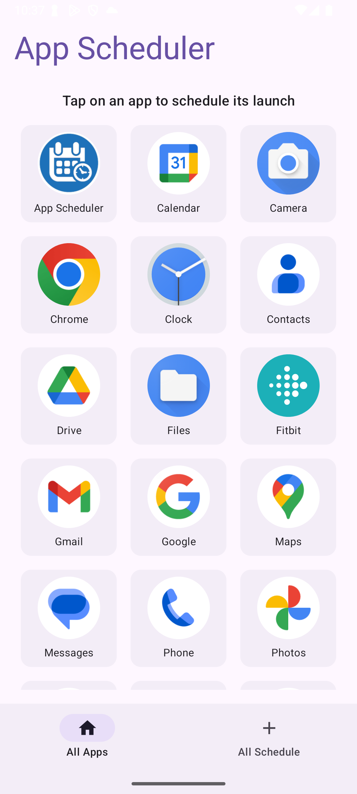
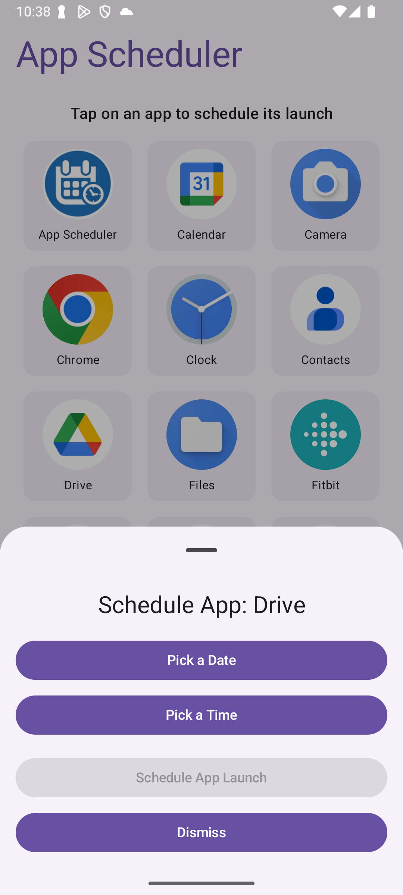
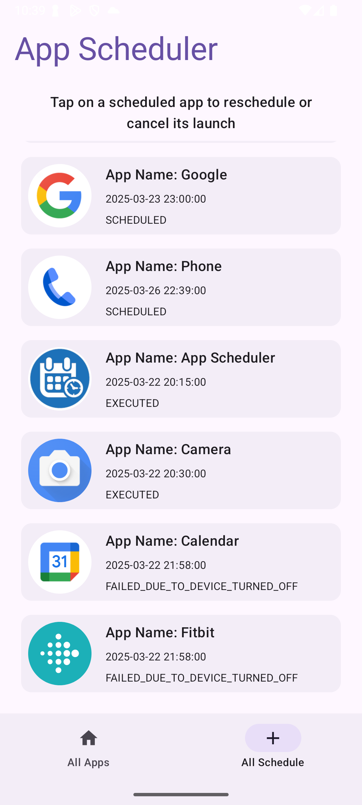
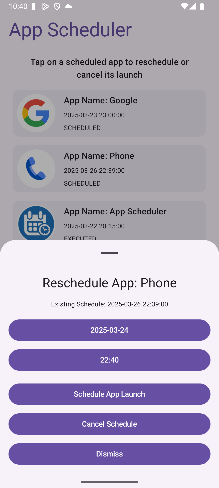

# Android App Scheduler

[](https://kotlinlang.org)
[](https://developer.android.com)
[](https://developer.android.com/jetpack/compose)
[]()
[]()
[]()
[](LICENSE)

An Android application that allows users to schedule automatic launches of installed applications at designated times, track execution history, and manage schedules with persistent alarms that survive device reboots.

---

## App Previews

| Installed Apps | Schedule App | Active Schedules | Reschedule & Cancel |
|:---:|:---:|:---:|:---:|
|  |  |  |  |

---

## Key Features & Requirements

- **App Discovery**: Lists launcher-enabled installed applications available for scheduling.
- **Precision Scheduling**: Schedules app launches at exact times using `AlarmManager`.
- **Modify & Cancel**: Allows updating scheduled times or cancelling pending schedules prior to execution.
- **Execution Tracking**: Maintains persistent records in Room database to track whether scheduled apps executed successfully or failed.
- **Reboot Persistence**: Automatically restores pending alarms after device reboots using `BootReceiver` and `RECEIVE_BOOT_COMPLETED`.
- **Background Launch Handling**: Utilizes `SYSTEM_ALERT_WINDOW` permission to enable reliable background activity launches on modern Android versions (Android 10+).

---

## System Architecture

The project adheres to **Clean Architecture** and **Unidirectional Data Flow (MVVM)** principles:

```
┌────────────────────────────────────────────────────────┐
│                   Presentation Layer                   │
│        Jetpack Compose UI  •  MVVM (ViewModels)        │
└───────────────────────────┬────────────────────────────┘
                            │
┌───────────────────────────▼────────────────────────────┐
│                      Domain Layer                      │
│        Use Cases  •  Domain Models  •  Contracts       │
└───────────────────────────┬────────────────────────────┘
                            │
┌───────────────────────────▼────────────────────────────┐
│                      Data Layer                        │
│   Room Database  •  Repositories  •  SystemAppSource   │
└────────────────────────────────────────────────────────┘
```

- **Domain Layer**: Core business logic and use cases (`AppsUseCase`, `LaunchScheduleUseCase`). Completely platform-agnostic and decoupled from UI.
- **Data Layer**: Room SQLite persistence (`AppDao`, `LaunchScheduleDao`), repository implementations (`AppRepositoryImpl`, `ScheduleRepositoryImpl`), and package manager data sources.
- **Presentation Layer**: Built 100% with Jetpack Compose using Material 3 theming, Navigation Component, and stateful ViewModels.

---

## Tech Stack

| Component | Technology |
|---|---|
| **Language** | Kotlin 2.1.10 |
| **UI Framework** | Jetpack Compose (BOM 2025.03.00, Material 3) |
| **Dependency Injection** | Koin 4.0.2 |
| **Local Database** | Room 2.6.1 (with KSP) |
| **Asynchronous** | Kotlin Coroutines & Flow |
| **Scheduling** | Android `AlarmManager` (`RTC_WAKEUP`) |
| **CI / CD** | GitHub Actions (automated build & signing) |
| **Testing** | JUnit 4, MockK, Turbine, Kotlinx Coroutines Test |

---

## Technical Challenges & Solutions

### 1. Package Visibility Filtering
Android 11+ (API 30+) restricts visibility of other installed apps. This app utilizes `QUERY_ALL_PACKAGES` and queries launcher intent activities (`Intent.CATEGORY_LAUNCHER`) to display only launchable applications.

### 2. Background Activity Launch Restrictions
Starting activities from the background is restricted on Android 10+ (API 29+). The app guides the user to grant `SYSTEM_ALERT_WINDOW` (Overlay) permission, which provides the necessary system capability to launch applications at scheduled times.

### 3. Alarm Execution During Doze Mode & Reboot
- Configures exact alarms via `AlarmManager` with `SCHEDULE_EXACT_ALARM`.
- Requests battery optimization whitelist (`REQUEST_IGNORE_BATTERY_OPTIMIZATIONS`) to avoid alarm throttling during Doze Mode.
- Implements `BootReceiver` with `goAsync()` to reschedule active alarms upon device startup (`BOOT_COMPLETED`).

---

## Environment & Build Setup

### Prerequisites
- **JDK**: Java 21 (required by Gradle and Kotlin compiler configuration)
- **Android Studio**: Android Studio Meerkat (2024.3.1+) or newer
- **Compile / Target SDK**: 35
- **Minimum SDK**: 26 (Android 8.0 Oreo)

### Building Locally
```sh
# Clone the repository
git clone https://github.com/asadullah012/appscheduler.git
cd appscheduler

# Build Debug APK
./gradlew assembleDebug

# Run Unit Tests
./gradlew test
```

---

## CI/CD: Automated Release & Signing

A GitHub Actions workflow ([`.github/workflows/release.yml`](.github/workflows/release.yml)) is configured to build, sign, and publish APKs whenever a new release is published.

### Configuring Signing Secrets
To generate signed release APKs in CI, configure the following secrets in **GitHub Repository → Settings → Secrets and variables → Actions**:

- `KEYSTORE_BASE64`: Base64-encoded release keystore (`base64 -i your_keystore.jks | pbcopy`)
- `KEYSTORE_PASSWORD`: Password for the keystore
- `KEY_ALIAS`: Alias of the signing key
- `KEY_PASSWORD`: Password for the key alias

---

## License

This project is licensed under the Apache License 2.0 - see the [LICENSE](LICENSE) file for details.
